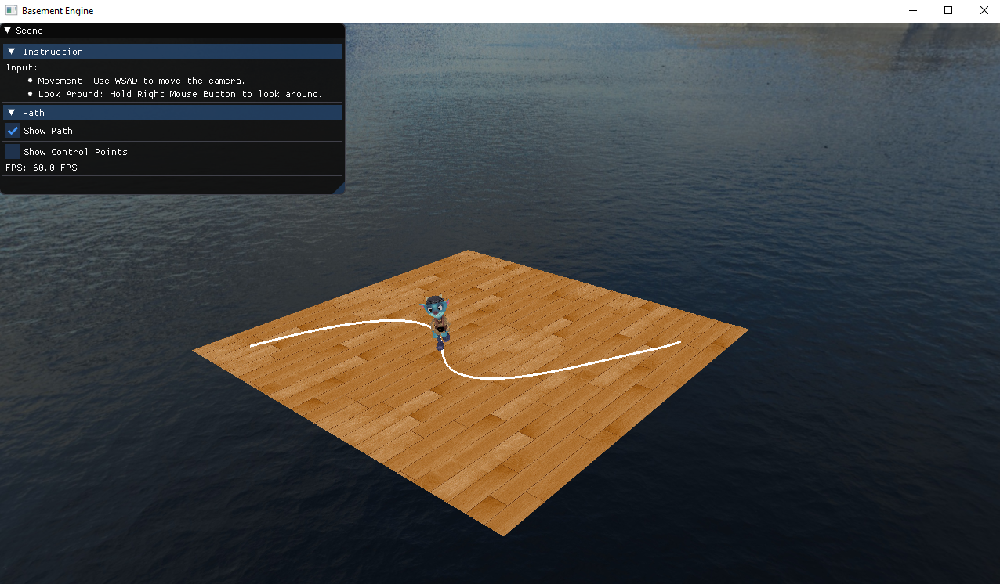

Project 1: Skeleton Animation

<!---
Some fonts: Arial, Bebas Neue, Verdana, Helvetica, Tahoma, Trebuchet, MS, Times New Roman,Georgia, Garamond
-->

Table of Contents
- [1. Introduction](#1-introduction)
- [2. Implementation](#2-implementation)
  - [2.1 Path](#21-path)
  - [2.2 Arc Length Calculation](#22-arc-length-calculation)
  - [2.3 Speend and Orientation](#23-speend-and-orientation)
- [3. Related Files](#3-related-files)

## 1. Introduction
>This project focuses on animating 3d character model when moving along a path. It is based on my project one. Please run the project executable under the following path:  
`Basement\cs560\cs560.exe`  

## 2. Implementation

### 2.1 Path
I used DeCastlejau Algorithm to calculate a bezier curve with 12 given control points. The curve satisfies first order continuity, therefore the character can run at constant speed when reaching the max speed. 

### 2.2 Arc Length Calculation
I used adaptive approach to construct a look up table for arc length base on the curve. The table is normalized after construction. When looking up for values in the table, I used binary search to retrieve data for entries in the table.

### 2.3 Speend and Orientation
I implemented ease-in/ ease out distance-time function to make the character have smooth animation at the beginning and end of the path. The character smoothly accelerates to the max speed at, keep running at constant speed, and then gradually slows down.

The orientation is updated at each frame as well, based on the direction the character is facing at.

## 3. Related Files
Basement\Basement\source\Basement\Renderer\Path\ *.h
Basement\Basement\source\Basement\Renderer\Path\ *.cpp
