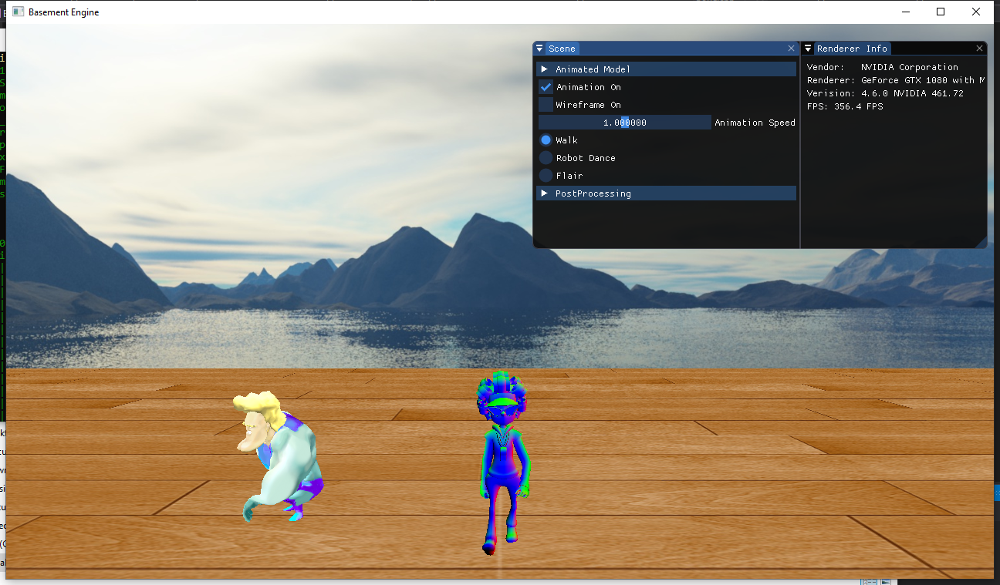

Project 1: Skeleton Animation

<!---
Some fonts: Arial, Bebas Neue, Verdana, Helvetica, Tahoma, Trebuchet, MS, Times New Roman,Georgia, Garamond
-->

Table of Contents
- [1. Introduction](#1-introduction)
- [2. Controls](#2-controls)
- [3. Interpolations](#3-interpolations)
- [4. Ajustable Settings](#4-ajustable-settings)
- [5. Related Files](#5-related-files)

## 1. Introduction
>This project focuses on animating 3d character model when moving along a path. It is based on my project one. Please run the project executable under the following path:  
`Basement\cs560\cs560.exe`  

## 2. Controls
>The demo executable supports both keyboard and mouse input, and the control is Unity-like. The keys and buttons work as below.

   | KeyCode |    Action     |
   | :-----: | :-----------: |
   |    W    | Move forward  |
   |    S    | Move backward |
   |    A    |   Move left   |
   |    D    |  Move right   |
   |    E    |  Move upward  |
   |    Q    | Move downward |

   |    Mouse Button    |   Action    |
   | :----------------: | :---------: |
   | Right Mouse Button | Look around |
   |   Scroll Up/Down   | Zoom in/out |

## 3. Interpolations

## 4. Ajustable Settings
[Put a setting picture here](https://www.youtube.com/watch?v=0N_RO-jL-90)

   |         Parameter          |                 Description                  |
   | :------------------------: | :------------------------------------------: |
   |        Animation On        |   Toggle for playing or pausing animation    |
   |        Wireframe On        | Toggle for rendering model in wireframe mode |
   | Animation Selection Button |  Choose the corresponding animation to play  |

There are also a few post-processing effects. 

## 5. Related Files
**Source Code**  
1. *Model loading*  
D:\dev\Basement\Basement\source\Basement\Renderer\Model.h
D:\dev\Basement\Basement\source\Basement\Renderer\Model.cpp
2. *Animation*
D:\dev\Basement\Basement\source\Basement\Renderer\Animation\ *.h
D:\dev\Basement\Basement\source\Basement\Renderer\Animation\ *.cpp

**Shaders**  
1. *Animation*  
Basement\cs560\assets\shaders\Grandma.glsl  
Basement\cs560\assets\shaders\SkeletonAnimation.glsl
2. *Debug*  
Basement\cs560\assets\shaders\SkeletonAnimation.glsl
