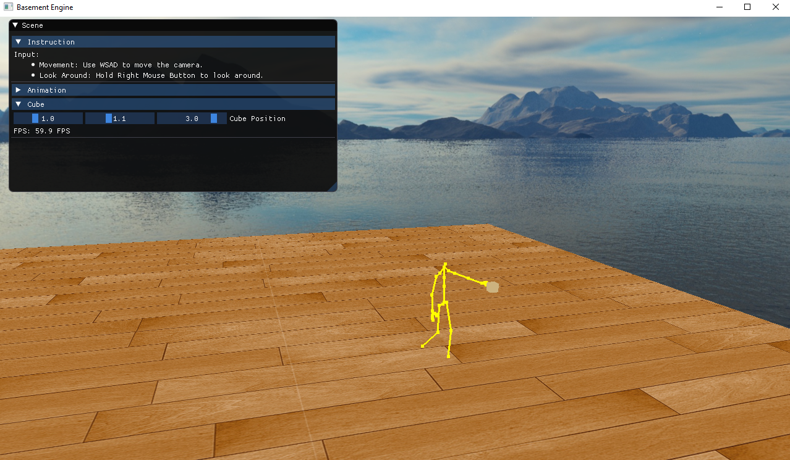

Project 3: Inverse Kinematics

<!---
Some fonts: Arial, Bebas Neue, Verdana, Helvetica, Tahoma, Trebuchet, MS, Times New Roman,Georgia, Garamond
-->

Table of Contents
- [1. Introduction](#1-introduction)
- [2. Implementation](#2-implementation)
  - [2.1 End effectors](#21-end-effectors)
  - [2.2 Coordinate transformation](#22-coordinate-transformation)
  - [2.3 CCD implementation](#23-ccd-implementation)
  - [2.3 Enforced priority](#23-enforced-priority)
- [3. Related Files](#3-related-files)

## 1. Introduction
>This project focuses on simulating inverse kinematics animation. The character model uses a list of 8 end effectors to simulate a grab movement. The cube is a interactive target and its position can be adjusted in "Scene->Cube->Cube Position". When the target is far away, the character will move toward the target. Once reaches a close range, it will stop the key frame animation and simulate inverse kinematics animation. 
`Basement\cs560\cs560.exe`  

## 2. Implementation

I implemented Cyclic-Coordinate Descent(CCD) to solve the inver kinematics. 

### 2.1 End effectors
Before doing any calculations, the first thing is to generate a list of end effectors. I used the left finger as the leafest end effector and by tracing upward in the hiearchy, I ended up using upper arm as the last end effector. 

### 2.2 Coordinate transformation
The important part about this project is about coordinate transformation. All the rotation is calculated in the space of the parent of the end effector. I transform the finger position to its parent space to get the start postion. I transformed the target point to character's object space by multiplying the inverse of character's model matrix and the inverse of current end effector's parent transform to get the end position. Since the coordinate system uses point K as origin, I could get `v_ck` and `v_dk` by easily normalizing the start poisition and end position.

### 2.3 CCD implementation
I used the cross product of `v_ck` and `v_dk` to get a vector perpendicular to both vectors, which will be used as a rotation axis. Then I calculated the dot product of `v_ck` and `v_dk` to get the rotation angle. So the end effector will rotate around the rotation axis with the given degree.

### 2.4 Enforced priority
Besides having a list of end effectors from finger to upper arm, I also generated a list of priority end effectors that can be used to make the animation simulation more realistic. The priority end effectors contains a few end effectors that have high hiearchical level which should be simulated along with the regular end effectors.

## 3. Related Files
Basement\Basement\source\Basement\Renderer\Animation\Animator.h
Basement\Basement\source\Basement\Renderer\Animation\Animator.cpp
Basement\Basement\source\Basement\Renderer\Animation\Animation.h
Basement\Basement\source\Basement\Renderer\Animation\Animation.cpp
