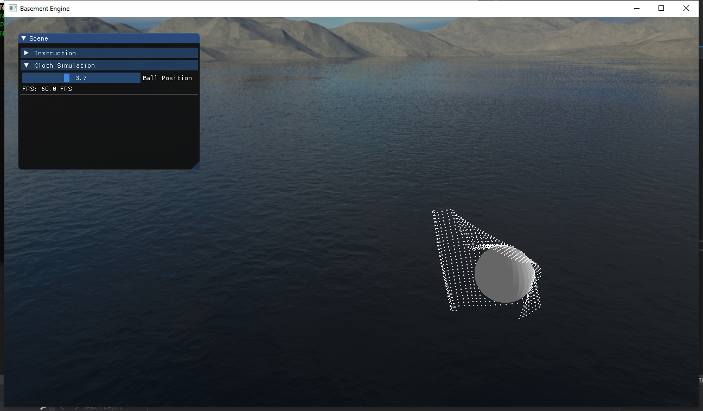

<span style="font-family:Bebas Neue; font-size:2.5em;">Project 4: Cloth Simulation</span>

<!---
Some fonts: Arial, Bebas Neue, Verdana, Helvetica, Tahoma, Trebuchet, MS, Times New Roman,Georgia, Garamond
-->

Table of Contents
- [1. Introduction](#1-introduction)
- [2. Implementation](#2-implementation)
  - [2.1 Mass Point](#21-mass-point)
  - [2.2 Constraint](#22-constraint)
  - [2.3 Cloth](#23-cloth)
- [3. Related Files](#3-related-files)

## 1. Introduction
>This project focuses on the simulation of cloth. I created a cloth consists of 900 mass points and the cloth's top left and top right corners are fixed like curtains. There is a movable ball in the scene whose position can be adjusted throgh the slider in gui panel. 



## 2. Implementation

I implemented cloth simulation by using _Newton's second law_, _Verlet integration_, and _iterative constraint satisfaction_. There are several important classes need to be addressed: mass point, constraint, cloth.

### 2.1 Mass Point
Cloth consists of a 2D array of mass points. The most important property of a mass point is its position and acceleration. I used the Verlet integration to calculate the position by doing the following:
```
glm::vec3 temp = m_Position;
m_Position = m_Position + (m_Position - m_PreviousPosition) * (1.0f - s_Damping) + m_Acceleration * dt;
m_PreviousPosition = temp;
```
Getting position by this method gives me smooth animation of cloth hanging in the air and interact with the ball. 

### 2.2 Constraint
This is probably the most important part of the cloth. The constraint class specifies which two mass point can interact with each other. When two mass point are getting away, the constraint between these two mass points will pull them back together and vice versa. It is essential to set the mass point pairs correct, which will later be discussed when constructing the cloth. There is a default ``restDistance`` between two mass points. The following code snippet describes how two constrained mass point changes their position accordingly to keep the distance.
```
glm::vec3 p1ToP2 = m_P2->GetPosition() - m_P1->GetPosition();
float currentDistance = glm::length(p1ToP2);
// The offset vector that could moves p1 into a distance of restDistance to p2
glm::vec3 correctionVector = p1ToP2 * (1.0f - m_RestDistance / currentDistance);
correctionVector *= 0.5f; // half the correction vector to move both p1 and p2
m_P1->OffsetPosition(correctionVector);
m_P2->OffsetPosition(-correctionVector);
```

### 2.3 Cloth
Cloth sets up a 2D array of mass points and set the constraints for them. During the initialization, each mass point is set to be constrained with its direct neighbor and secondary neighbor, so that adjacent mass points can interact with each other to keep a resting distance. 

## 3. Related Files
Basement\Basement\source\Basement\Renderer\Cloth\Cloth.h
Basement\Basement\source\Basement\Renderer\Cloth\Cloth.cpp
Basement\Basement\source\Basement\Renderer\Cloth\Particle.h
Basement\Basement\source\Basement\Renderer\Cloth\Particle.cpp
Basement\Basement\source\Basement\Renderer\Cloth\ParticleConstaint.h
